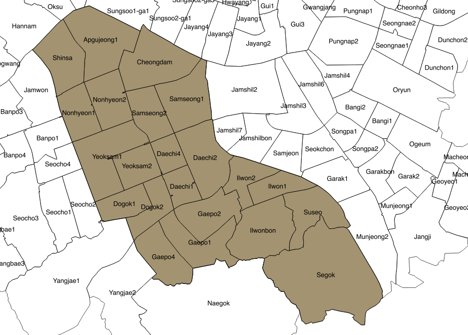
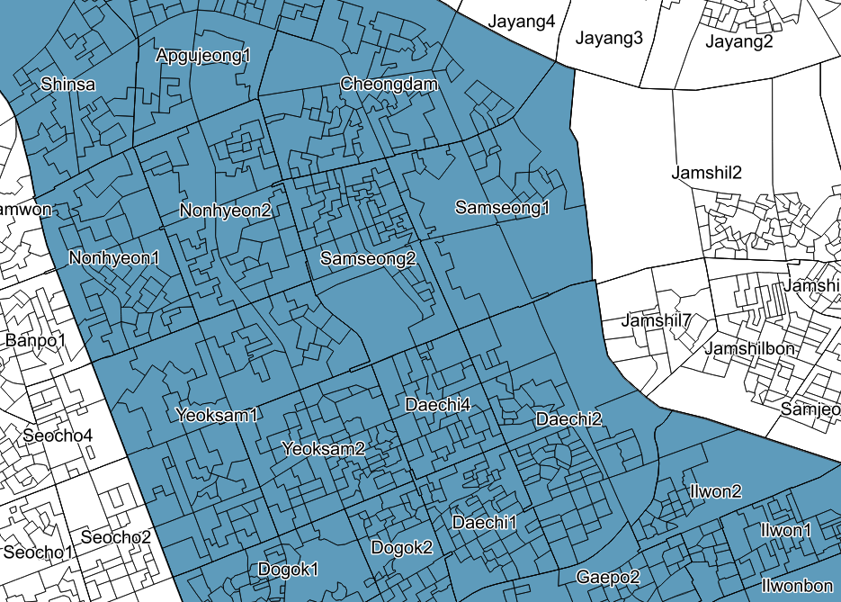

# Spatial Boundary

## Administrative District *(Gu)*
*Gu*, is a sub-municipal unit in South Korea. *Gu* is normally regulated when a city has at least a population of 500,000 persons.
Seoul has 25 *gu*s, of which the area and population varies. Seocho has the largest area (47$km^2$) whereas Jung has the smallest (9.96$km^2$).
Songpa and Jung are the most and least populated areas, which are approximately 640,830 and 117,781 persons. To find out more see https://en.wikipedia.org/wiki/List_of_districts_of_Seoul.

```{r, echo=FALSE, fig.height=8, fig.width=6, fig.show='hold',fig.align='center',fig.cap="\\label{fig:figs} Districts(Gu) in Seoul"}
knitr::include_graphics("images/03_gu.png")
```


## Census tracts *(Dong)*
*Dong*, known as census tracts, are the smallest boundary of which the authority is owned by the urban government.
Each gu comprises two types of boundaries as *Hengjeong dong*s and *Beopjeong dong*s. *Hengjeong dong*s, sub-municipal districts, were established for administrative convenience, such as resident registration. These *dong*s could be consolidated, divided, or founded due to population increase or decrease e.g. Jongno 1-2-3-4ga dong. *Beopjeong dong*s, legal districts, are towns or villages that were left for historical significance (Legal dongs were based on cadastral maps made from the Land investigation project during the Japanese colonial years). Due to its historial and symbolic meanings, people tend to remember the names easier than administrative ones. As of 2014, Seoul has 424 administrative dongs and 467 legal dongs. Gildong in Songpa district was most populated area in 2014 at 49,535 persons, whereas Sogongdong in Jung district was the least populated at 735 persons.

```{r, echo=FALSE, fig.height=8, fig.width=6, fig.show='hold',fig.align='center',fig.cap="\\label{fig:figs} Census tracts(Dong) in Gangnam"}

```


## Administrative Census Block *(Jipgegu)*
The finest scale is *Jipgegu*, or census block. This boundary is mainly to retrieve the population from a minimum statistical area, thus does not function as an administrative unit. Each Jipgegu consists of 60-500 residents, and the boundaries are renewed every year. As of 2013, Seoul has 16,470 jipgegus. All boundary data were provided in a shapefile in a 5-year period from 1975-2015, except the *Jipgegu* where the last update was in 2016.

```{r, echo=FALSE, fig.height=8, fig.width=6, fig.show='hold',fig.align='center',fig.cap="\\label{fig:figs} Census block(Jipgyegu) in Gangnam"}

```


