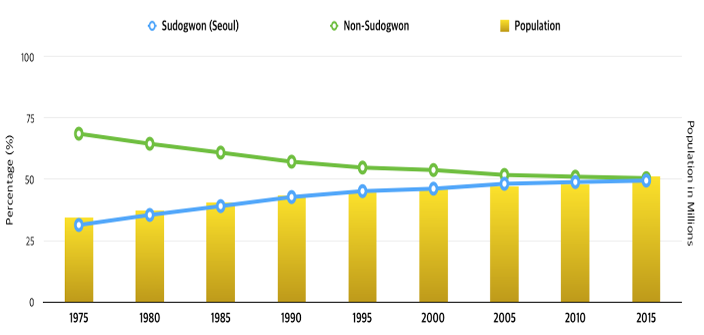

# Population

## Population Census
The population of Seoul and the great metropolitan area *Sudo-gwon*, has increased consistently as the national economy developed, where high demand of job, education, and public transport have been created. Korean's rapid urbanisation affected the rural citizens migrate to the *Sudo-gwon* area, resulting in reformations in administrative boundaries. Have a look at the census table below:

```{r popDF, fig.cap= "Sudo-gwon(Great) metropolitan area", echo=FALSE, warning=FALSE,message=FALSE}
library(tidyverse)
library(readxl)

path <- ("chp3-files/sudo_pop.xlsx")
pop<- path %>% 
      excel_sheets() %>% 
      set_names() %>% 
      map(read_excel, path = path)

new_col_name <- c("sd_nm", "sgg" ,"sd_cd", "sgg_cd", "sgg_nm_kr", "pop_total", "pop_male", "pop_female")

popList  <- lapply(pop, setNames, nm = new_col_name)
popList2 <- lapply(popList, function(x) cbind(x, year = ""))

for (i in 1:9) {
  popList2[[i]]$year <- 1970 + (i * 5)
}
popDF <- do.call(rbind, popList2)
DT::datatable(popDF, rownames = FALSE)
```

The rate of population growth in the period 1975-2015 is shown in [Figure 3.2]. The yellow bars account for the overall population in South Korea in every 5 years. The blue and green line shows the rate of the population in the Sudogwon and the non-Sudogwon respectively. It clearly shows that the population around Seoul has gradually increased from around 30% to 49.5% in 40 years.


In 1975, the total population in the Sudogwon area was just over 30%, then rose to around 45% in 1995. The figures continued to increase until it reached 49.5% in the 2015 census. It is therefore clear that people have constantly migrated to Seoul since 1975, and if these patterns continue, migration to Sudogwon is likely to outstrip migration to Non-Sudogwon in the coming years. </br>
```{r, echo=FALSE, fig.height=8, fig.width=6, fig.show='hold',fig.align='center',fig.cap="\\label{fig:figs} Temporal patterns of population rate between Sudogwon and Non-Sudogwon area"}

```


## De Facto Population
*De facto population* is a recently introduced, estimated population based on LTE mobile data. This data is designed to capture real-time population by receiving signals from nearby stations every hour, by census block to district scale. Recent news says that the LTE users have overshot 50 million registration, meaning that people who have mobile tend to use the LTE service. The youth and elderly who have low LTE registration rate is replaced by the living population from the Census data. The estimated numbers were rounded from 5 decimal points (e.g. 422.10294 -> 422 persons), therefore the sum of each value may not match the total sum.

*Foreign residents* using either Korean LTE SIM cards or overseas roam service are estimated in the same way as it was for domestic users. You can easily filter foreign population by nationalities.

*Metropolitan residents* are people who live outside Seoul but commute to the city everyday. Because more than 10 million commuters from bed towns - from Gwacheon to airport newtowns near Incheon airport - commute to Seoul, this data gives includes a district code to give an overview of their flows.

