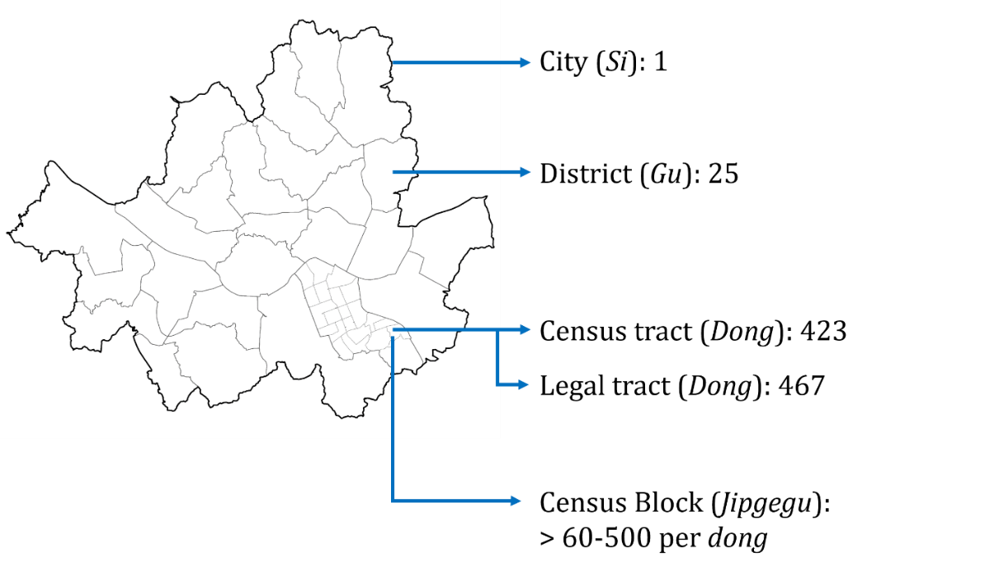
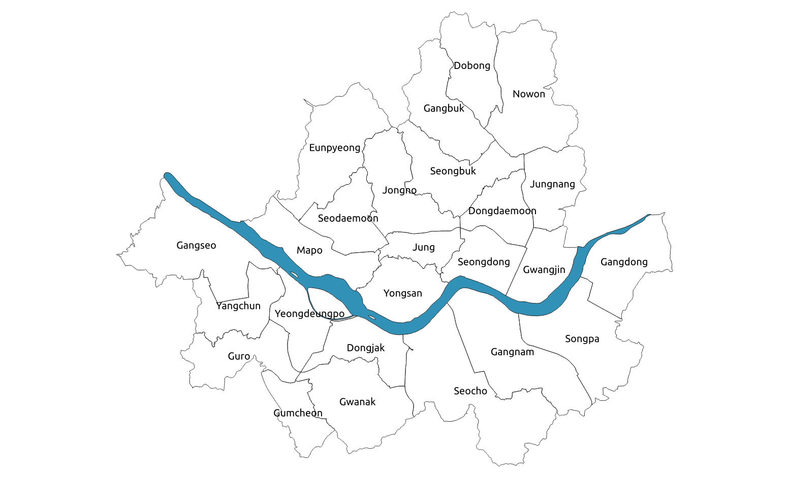

--- 
title: "Seoul Data Catalogue"
author: "신혜섭-Hyesop Shin"
date: "r Sys.Date()"
site: bookdown::bookdown_site
documentclass: book
bibliography: [book.bib, packages.bib]
biblio-style: apalike
link-citations: yes
description: "This is an introduction to Hyesop's Ph.D data for Seoul city."
---

# Preface {-}

Hello, welcome to this website! This site offers a handful of data from Seoul, including geospatial data,
population, housing, landuse, industry, traffic, society, hospitality, and environment. Note that this page hasn't got
any license to it, so you can look through my explanation and examples, and copy them without permission.

```{r, echo=FALSE, fig.height=8, fig.width=6, fig.show='hold',fig.align='center'}
knitr::include_graphics("images/01_intro.png")
```

<!--chapter:end:index.Rmd-->

# Introduction of Seoul

## Overview
- Capital of South Korea
- Area: 605.21 km2 (233.67 sq mi)
- Population: 9,971,111 (678,102 international residents, 2015 NSO)
- Language: Korean
- Currency: Won

## City Hierarchy
```{r, echo=FALSE, fig.height=8, fig.width=6, fig.show="hold" fig.align= "center"} 

```

The city has four hierarchies, Si, Gu, Dong, and *Jipgegu*, from city to block level. Within the *Si*(city) scale, Seoul has 25 administrative districts, gu, of which the spatial size is similar to the boroughs in London. The river Han penetrates horizontally through the city centre, from east to west, which divides 14 gus to the north, and 11 to the south.</br>
Each gu comprises two types of boundaries as *Hengjeong dong*s and *Beopjeong dong*s. *Hengjeong dong*s were established for administrative convenience, such as resident registration. These *dong*s could be consolidated, divided, or founded due to population increase or decrease. *Beopjeong dong*s are towns or villages that were left for historical significance (Legal dongs were based on cadastral maps made from the Land investigation project during the Japanese colonial years). As of 2014, Seoul has 424 administrative dongs and 467 legal dongs. The finest scale is *Jipgegu*, or census block. This boundary is mainly to retrieve the population from a minimum statistical area, thus does not function as an administrative unit. Each Jipgegu consists of 60-500 residents, and the boundaries are renewed every year. As of 2013, Seoul has 16,470 jipgegus. All boundary data were provided in a shapefile in a 5-year period from 1975-2015, except the *Jipgegu* where the last update was in 2015.

<!--chapter:end:01-Introduction-of-Seoul.Rmd-->

# Spatial Boundary

## Administrative District *(Gu)*
A sub municipal unit in South Korea. Cities over 500,000 people are allowed to have a gu.

- Total number in Seoul: 25
- Coordinate system: Korean Central Belt 2000 (EPSG: 5181)
- Columns: City code, Gu code, Gu name, Gu area
- Largest / Smallest
- Area: Seocho(47km2) / Jung(9.96km2)
- Population: Songpa(640,830) / Jung(117,781)

```{r, echo=FALSE, fig.height=8, fig.width=6, fig.show='hold',fig.align='center',fig.cap="\\label{fig:figs}Gu in Seoul"}

```

## Census tracts *(Dong)*
The smallest level of urban government to have its own office and staff in South Korea</br>

Types: administrative dong, legal-status dong

- Administrative dong: Name of the community office that controls the place. All administrative works as well as clinics are based on this level
- Legal-status dong: A traditional area (town, village) name. The name of a unique region that serves as an address


Total number

- Administrative dong (2014): 423
- Legal-status dong (2014): 469
- Coordinate system: Korean Central Belt 2000 (EPSG: 5181)
- Columns: Base year, admin code, admin name
- Largest / Smallest
- Population: Gil-dong, Songpa-gu (49,535) / Sogong-dong, Jung-gu (735)


## Administrative Census Block *(Jipgegu)*
Developed boundary map of the smallest(block) unit among the boundaries announced by the National Statistic Office(NSO)

- Reference : NSO
- Time Period : 2015
- Data Collected: 1 year
- Data Type : .csv, .shp
- Spatial range : Seoul
- Coordinate system: Korean Central Belt 2000 (EPSG: 5181)


Table: (\#tab:foo) Jipgegu Attribution field

| Field       |Field Description| 
|:------------|:-----------|
| Block code | Name of block|
| Block name | X-coord of block cell centre|
| Centriod X-coord | X-coord of block cell centre|
| Centriod Y-coord | Y-coord of block cell centre|
| Census tract code | Tract code|
| City code | City code|
| Type of block | Large, Medium, Small |
| Type of block buffer | Large, Medium, Small|
| Station influenced area | Block proximity to Station|
| University area | Block proximity to a University zone|


Providing a spatial unit that understands a specific area (100 persons per block) </br>
Providing a spatial unit that further subdivides administrative boundaries, such as dong,
for finer analysis of market characteristics in the region </br>
The number of block accounts for 20% of NSO block </br>
Resident blocks in non-apartment accounts for 60-80 persons


<!--chapter:end:02-Spatial-boundary.Rmd-->

# Population

## Population Census
Population data of residence

- Reference: Korean Statistics Office
- Time Period : 2011 - 2015
- Data Collected: Monthly
- Data Type : .csv
- Spatial range : Seoul
</br>

| Field | Description |
|------------:|-----------:|
| std_yy | Baseline year |
| std_mt | Baseline month |
| sexdstn_cd | Sex |
| agrde_cd | Age group |
| rspop_cnt | Population |
| adstrd_cd | Census tract code |
| signgu_cd | City code |

</br>
</br>


## Employees at Working place
Data on the number of employees per census block, based on the basic survey data of the business

• Reference: Seoul city 
• Time Period : 2011 - 2013
• Data Collected: Annually
• Data Type : .csv
• Spatial range : Seoul
</br>


## De Facto Population
구분: 인구/가구 </br>
데이터셋명: 생활인구 </br>
자료유형: 속성(csv) </br>
시간범위: 2017.01.01-2018.04.18 </br>
공간범위: 서울전역 </br>
적재주기: 월 </br>
제공기관: KT </br>

파일명:</br>
- 내국인: SE_SPOP_LOCAL_RESD_YYMM </br>
- 외국단기: SE_SPOP_TEMP_RESD_YYMM </br>
- 외국장기: SE_SPOP_LONG_RESD_YYMM </br>
- 대도시권 생활인구: SE_SPOP_ORGN_CT_YYMM </br>
- 데이터셋설명: 생활인구란 거주인구가 아닌 실제로 생활하는 인구로, 1시간 단위로 서울시 전체, 자치구별, 행정동별, 집계구별로 서울을 커버하는 KT의 통신기지국(LTE 시그널 데이터 기반)에 존재하는 인구를 기초로 추정함. LTE가입률이 떨어지는 저연령과 고연령층은 주민등록인구비율을 반영하여 생활인구를 대체함. 그리고 장단기체류 외국인은 국내 휴대폰에 가입한 외국인의 이용정보와 국내의 로밍서비스를 받는 외국인 정보를 활용하여 생활인구 추계과정과 동일하게 접근하고 국적별로 보정함. '대도시권' 데이터는 생활인구 데이터에 대도시권의 거주지 코드를 포함한 데이터임
추정된 데이터로 소수점(5자리) 이하값이 있으며, 각 값의 합은 전체합계와 일치하지 않을 수 있음


<!--chapter:end:03-Population.Rmd-->

# Traffic

Traffic GIS DB
- O-D Matrix </br>
- Traffic Volume (67 within Seoul) </br>
- Road network </br>
- Bus(Regular, Intercity) </br>


## Traffic facilities
Traffic facilities are the geographic locations of bus stops and subway stations in Seoul. This dataset is provided by Seoul TOPIS(Transport Operation and Information Services, 서울시교통정보센터), and KAIS(Korean Address Information System, 국가주소정보시스템), during the period of January 2015 - August 2016. The data are saved in an excel sheet and a shape format.

* EPSG(Coordinates): 5181(Korea 2000 Central Belt)

In the folder, you will probably notice two sets of files, which either starts with TB_O_SB_STATN or TB_E_BUSSTOP: 

| Type    | Description | Code |
|:--------|:------------|:------------|
| `Facilities` | Subway location | `TB_O_SB_STATN`|
| `Facilities` | Bus location    | `TB_E_BUSSTOP` |
</br>
* Bus stop: Attributes

| NO| Attribute Name     | Note |
|:--|:-------------------|:------------|
| 1 |  `ID`              |  |
| 2 |  `Bus stop number` |  |
| 3 |  `Bust stop name`  |  |
| 4 |  `Year`            | Jan.2015-Aug.2016 |
| 5 |  `TM-X`            |  |
| 6 |  `TM-Y`            |  |
</br>

* Bus stop: Shape file attributes (EPSG:5181)

| NO| Column Code  | Column Name |
|:--|:-------------|:------------|
| 1 |  `YYYYMM`    |  Year+Month |
| 2 |  `LINE_NO`   |  Bus number |
| 3 |  `SEQ_NO`    |  Order      |
| 4 |  `BUS_STA_NM`|  Bus stop name |
| 5 |  `X_COORD`   |  X coordinate |
| 6 |  `Y_COORD`   |  Y coordinate |
| 7 |  `ARSID`     |  Reference |
</br>

* Subway: Attributes

| NO| Attribute Name  | Note |
|:--|:----------------|:------------|
| 1 |  `ID`           |  |
| 2 |  `Station name` |  |
| 3 |  `Line number`  |  |
| 4 |  `Year`         | Jan.2015-Aug.2016 |
| 5 |  `TM-X`         |  |
| 6 |  `TM-Y`         |  |
</br>

* Subway: Shape file attributes (EPSG:5181)

| NO| Column Code  | Column Name |
|:--|:-------------|:------------|
| 1 |  `GU_NM`     | Year+Month |
| 2 |  `GU_CD`     | Bus number |
| 3 |  `SUB_STA_SN`| Order      |
| 4 |  `KOR_SUB_NM`| Bus stop name |
| 5 |  `Point_X`   | X coordinate |
| 6 |  `Point_Y`   | Y coordinate |
</br>


<!--chapter:end:04-Traffic.Rmd-->

# Pollution

<!--chapter:end:05-Pollution.Rmd-->

# Patients


<!--chapter:end:06-Patients.Rmd-->

`r if (knitr::is_html_output()) '
# References {-}
'`

<!--chapter:end:09-references.Rmd-->

